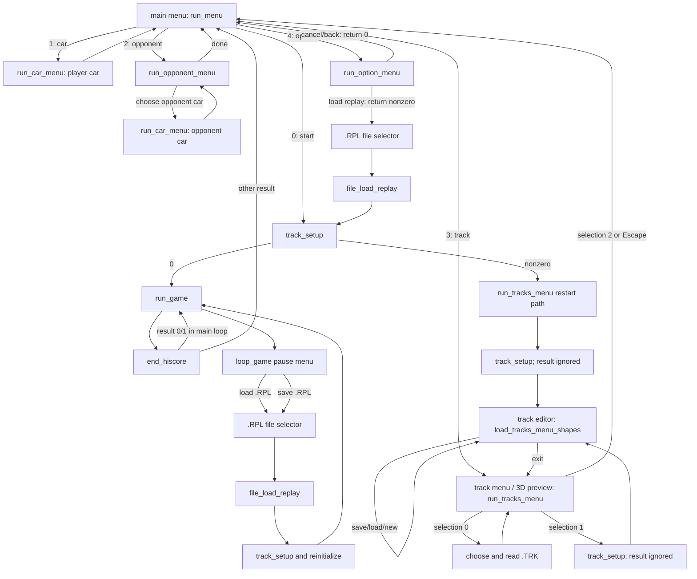

# Modes and built-in track editor

## Scope and evidence convention

This documents behavior visible in the current reconstructed C contributions. Source line references are authoritative for the descriptions below; absolute image load offsets are cross-references from `evidence/functions.json` / `python tools/context.py`. Calls drawn from C are source-derived control flow, not a new machine-call-graph claim. Resource IDs are given literally where the code loads their text; the packed `TEDIT.PRE`, `SDTEDIT.PES`, and `MISC.PRE` payloads are not decoded here.

## Mode transition graph

`main` maps `run_menu()` results 0/1/2/3/4 to race/player car/opponent/track/options (source `src/obj_seg000.c:530-551`). Main-menu result 0 enters race preparation; a nonzero `track_setup()` result diverts to `run_tracks_menu(1)` and then back to the main menu (`:552-577`). A successful setup reaches `run_game()` (`:594-623`). The normal track-menu entry is result 3. Its three buttons dispatch to load (`selection == 0`), enter editor (`selection == 1`), or return (`selection == 2`); on return the menu releases its preview window (`:893-1035`).

The editor itself has no `run_game()` edge. It returns to the track preview. The editor's `C`/`c` key calls `track_setup()`, shows the indexed editor message, and, when the returned value is greater than 1, walks the stored route coordinates to highlight its pieces (`src/obj_seg009.c:624-644`, `:584-596`). The actual drive path is the main-menu start branch above. Track-menu entry with `restart != 0` jumps directly to setup/editor without first drawing the preview (`src/obj_seg000.c:905-908`, `:1026-1035`); that is the recovery route after failed race setup.

## Track preview and editor entry

`run_tracks_menu` builds a 3D track preview by loading the sky selected at `td14tb[0x384]`, loading 3D shapes, setting projection, initializing preview state, calling `draw_track_preview`, then freeing shapes and sky (`src/obj_seg000.c:909-925`). It prints the track name and, when the matching `.HIG` has a valid top record, the best entry (`:927-947`). The button labels are resource IDs `bmt`, `bet`, and `bmm` (`:949-956`); behavior is determined by button index, as listed above.

The editor loads `SDTEDIT` shapes and `TEDIT` text/layout data. It resolves 19 terrain shapes, four cursor shapes `crs0..crs3`, four placement-outline shapes `ucr0..ucr3`, the `pbox` palette layout, and `snam`/`mnam`/`tnam` piece-name tables (`src/obj_seg009.c:204-240`). There are 186 piece mask/fill shape pairs and 186 three-character name keys (`:227-240`, `:438-445`). It creates four size-specific cursor windows from the `crs` dimensions (`:208-215`).

The track block is contiguous: `td14tb` is followed by `td15p_9` at a stride of `0x385` bytes, and the `.TRK` writer persists `0x70A` bytes, exactly two such blocks (`src/obj_seg000.c:479-483`; `src/obj_seg009.c:730-732`). The editor reads the sky selector from `td14tb[0x384]` (`src/obj_seg009.c:664-670`). The game initializes 30 row offsets for both maps (`src/obj_seg000.c:432-440`). The editor's logical map is 30×30; its viewport displays 12 columns by 11 rows at 16 pixels per cell (`src/obj_seg009.c:304-322`, `:353-355`, `:379-431`, `:938-1027`).

## Cursor, palette, and input

The editor starts with the map focused (`paletteArea = 0` means map, `1` means palette in the drawing/input branches); initial map position comes from `sampled_trk_column` and `g_cur_track_row` (`src/obj_seg009.c:242-262`). `originX` and `viewTop` scroll the 30×30 map to keep the cursor and selected footprint inside the 12×11 viewport (`:304-322`). The map cursor is drawn from `road_tile_shapes[tileSize]`; palette focus uses a rectangular outline (`:379-434`, `:458-477`). Hovering updates the localized name in `tnam` and reports a pending validation message (`:436-456`).

`activeGroup == 0` is the terrain palette. Groups 1–10 are object-piece categories; each category uses a 6×6 palette page in `pbox` (`src/obj_seg009.c:249`, `:324-338`, `:897-936`). Left/right at palette row 6 changes category; F1–F10 select categories 1–10; `-`/`+` cycle categories; scan code `0x5400` selects terrain (`:599-623`, `:839-883`). Palette row 7 opens the sky selector and stores its answer in `td14tb[0x384]` (`:659-671`). On row 8, column 0 opens the `.TRK` load selector and nonzero column starts a terrain-template/new-track operation (`:672-706`). On row 9, column 0 saves; nonzero column exits, prompting about unsaved edits (`:707-747`).

Arrow keys move the map or palette cursor and skip `pbox` continuation cells. Space or scan code `0x5200` toggles focus when not converted into an Enter on a map/palette mouse hit (`src/obj_seg009.c:510-571`, `:607-645`, `:798-883`). The scrollbar hit regions update `originX` and `viewTop`; map/palette hit regions convert screen coordinates to logical cells (`:482-565`). The selected footprint is aligned back from the right/bottom visible edge for two-cell pieces (`:516-530`).

## Placement and validation

Object piece footprint comes from `trklst[selectedPiece].ss_multiTileFlag`: 0 is 1×1; 1 is 1×2; 2 is 2×1; 3 is 2×2 (`src/obj_seg009.c:282-302`). The editor writes the anchor piece to `td14tb`, then writes marker bytes for covered cells: `0xFE` below, `0xFF` to the right, and for 2×2 additionally `0xFD` at bottom-right (`:764-794`). Pieces extending beyond row/column 29 are not placed (`:764-765`). Terrain selection writes to `td15p_9` (`:749-763`). Repeating Enter on the same map cell swaps the selected piece/terrain with the remembered old cell (`:750-759`, `:766-777`). Each edit marks the map dirty and schedules redraw/validation.

Validation has two layers:

* `validate_track_elements` (source name; evidence boundary `seg009:0x1C81C`, inventory label `sub_2C81C`) first clears broken multi-cell markers. It checks occupied pieces against terrain. Terrain 1–5 admits only object IDs `0x22`, `0x23`, `0x67..0x6C`, and `0xAB..0xAE`; covered-cell markers are resolved back to their anchor. Terrain 7–10 delegates compatibility to `subst_hillroad`. Other nonzero terrain types are rejected. Rejected pieces are erased and the function returns editor message code 12, 13, or 14 (`src/obj_seg009.c:1030-1076`). Terrain 0 and 6 bypass these compatibility checks.
* `clear_invalid_track_tiles` (source name; evidence boundary `seg009:0x1C9B4`, inventory label `sub_2C9B4`) tracks occupied continuation cells, verifies the exact marker pattern for 1×2, 2×1, and 2×2 objects, and erases orphaned, overlapping, or malformed pieces (`src/obj_seg009.c:1078-1136`).

Separately, `track_setup` validates the horizontal and vertical terrain-connection sequence across the 30×30 map; a mismatch returns code 11. It then resolves track objects/start directions and builds the route coordinates used by race setup and the editor's `C` route trace (`src/obj_seg004.c:1151-1236`, `:1238-1315`, `:1460-1632`, `:1700-1710`, `:1848-1867`). It returns 0 on success; main diverts nonzero results back to track editing (`src/obj_seg000.c:563-569`).

## Load, save, new track, and exit

The track-menu load button opens `do_fileselect_dialog(..., ".trk", ...)`, builds the path, reads into `td14tb`, and returns to the 3D preview (`src/obj_seg000.c:1013-1025`). Inside the editor, the load palette action first asks about dirty edits, then opens the same `.trk` selector; on success it reads the block, calls `track_setup`, resets the cursor to the sampled start, and clears the dirty flag (`src/obj_seg009.c:686-706`).

Save opens `do_savefile_dialog` for a `.trk` name, checks an existing file with `file_find` and an overwrite dialog, then writes `td14tb` for exactly `0x70A` bytes. Successful save initializes that track's `.HIG` using `highscore_write_a(1)` and clears `mapDirty`; write errors show resource `ser` and allow retry (`src/obj_seg009.c:707-742`). New/template selection clears the first `0x384` object bytes, copies the selected 901-byte terrain template into `td15p_9`, blanks the track name, and marks it dirty (`:672-685`). Exit checks `mapDirty`; the dialog's save choice jumps into the same writer (`:742-747`).

## Other non-race modes

### Car selection

`run_car_menu` enumerates `car*.res`, keeps up to 32 four-character IDs, sorts them lexically, and begins at the caller's current car (`src/obj_seg000.c:1236-1340`). It loads the selected car's shapes, aerodynamic data and description; renders the car and speed graph; and cycles paints/transmission state (`:1375-1455`). Button indexes are Done, next car, previous car, transmission toggle, and material cycle. Enter/Space/Escape activate a button; up/down and the mouse change selection. Done copies the selected ID to the passed pointer and returns (`:1547-1644`). Main calls it for the player (`:547-551`); opponent selection calls the same function for the AI car (`:1803-1816`).

### Opponent selection

`run_opponent_menu` loads `opp0..opp6`; opponent type 0 means no opponent and 1–6 select opponent profiles (`src/obj_seg000.c:1655-1761`). Its five actions are previous, next, no opponent, select opponent car, and done (`:1713-1727`, `:1785-1839`). The car action is disabled when no opponent is selected. On done, an unset opponent car copies the player's car, chooses the alternate of the player's low material bit, and sets transmission 0; with no opponent it sets the opponent-car sentinel to `0xFF` (`:1818-1831`).

### Options and replay selection

`run_option_menu` presents the `mop` dialog and dispatches input-device settings (`mid`, keyboard/joystick/mouse), `do_mof_resource_text`, `do_sonsof_resource_text`, replay load, graphics levels, and DOS text (`src/obj_seg000.c:1863-1944`). Selecting replay opens the `.rpl` file selector and calls `file_load_replay`; it returns nonzero to main, which goes on to race setup. Cancel/back returns 0 to the main menu (`:1914-1938`, `:543-546`). The exact user-facing words for the short resource IDs are in packed resources, so this description keeps the IDs and handler names.

The in-game pause dialog in `loop_game` has separate `.rpl` load and save actions. `file_load_replay` reads at `td13_replay_hdr`, restores its leading `GAMEINFO`, and leaves the following payload in the contiguous track/replay buffers. The pause load branch calls `track_setup`, reinitializes game state, and reloads car resources when the replay changed sky/car/opponent settings (`src/obj_seg005.c:2071-2170`). Save picks a `.rpl` name, handles overwrite confirmation, then calls `file_write_replay` (`:2171-2197`). The fixed `0x724`-byte prefix is `GAMEINFO` (0x1A bytes) plus the two track blocks (0x70A bytes); the writer copies current settings into that header and appends `game_recordedframes` bytes (`src/obj_seg000.c:477-485`; `src/obj_seg005.c:1268-1291`).

### High scores and post-race results

The selected track's `.HIG` file holds seven 52-byte records (`0x16C` bytes total); `highscore_write_a(0)` loads it, and `highscore_write_a(1)` creates blank defaults (`src/obj_seg000.c:1038-1072`). The track preview displays the leading valid row (`:933-947`). `end_hiscore` compares the stored `.TRK` bytes with the current track before allowing a record; a finished time can enter the seven-place table, prompt for a name, and save the sorted table (`:2148-2183`, `:1157-1212`, `:1214-1226`). It also displays race result/speed/jump data and optional opponent animation. Main consumes result 0/1 by continuing its game loop; other results return to the menu (`:594-610`).

## Address cross-reference

Absolute load offsets; ends are exclusive. The member extents are inventory/context boundaries, not far segment:offset notation.

| Mode/function | Image extent | Source anchor |
|---|---:|---|
| `run_menu` | `seg000:0x0F3C–0x10D0` | `src/obj_seg000.c:815-887` |
| `run_tracks_menu` | `seg000:0x10D0–0x1588` | `src/obj_seg000.c:893-1036` |
| `highscore_write_a` / text / entry | `seg000:0x1588–0x1A1C` (members `0x1588`, `0x168E`, `0x18D4`) | `src/obj_seg000.c:1038-1155` |
| `highscore_write_b` | `seg000:0x1BB4–0x1C42` | `src/obj_seg000.c:1214-1226` |
| `run_car_menu` | `seg000:0x1C42–0x293C` | `src/obj_seg000.c:1236-1649` |
| `run_opponent_menu` | `seg000:0x293C–0x2F4A` | `src/obj_seg000.c:1655-1861` |
| `run_option_menu` | `seg000:0x2F4A–0x3178` | `src/obj_seg000.c:1863-1944` |
| `end_hiscore` | `seg000:0x3178–0x44CF` | `src/obj_seg000.c:1957-2512` |
| `track_setup` | `seg004:0x106D4–0x117CA` | `src/obj_seg004.c:1151-1867` |
| `file_load_replay` / `file_write_replay` | `seg005:0x12C92–0x12D2E` | `src/obj_seg005.c:1268-1291` |
| `loop_game` pause/replay actions | `seg005:0x13B4C–0x14D64` | `src/obj_seg005.c:1822-2235` |
| editor / icons / viewport | `seg009:0x1A2BC–0x1C81C` (members `0x1A2BC`, `0x1BEB6`, `0x1C0A8`) | `src/obj_seg009.c:143-1028` |
| element validator / marker cleanup | `seg009:0x1C81C–0x1CC52` (`sub_2C81C`, `sub_2C9B4`) | `src/obj_seg009.c:1030-1136` |

## Evidence and limits

The editor path is directly present in the source contribution and maps to the `seg009` member extent. The old note that this executable had no editor loop is contradicted by `src/obj_seg009.c:143-895`, resource loads at `:204-221`, and the menu edge at `src/obj_seg000.c:1026-1035`. Exact localized button text remains in packed resource payloads; all navigation and actions above are established from source call sites and selection indexes.

